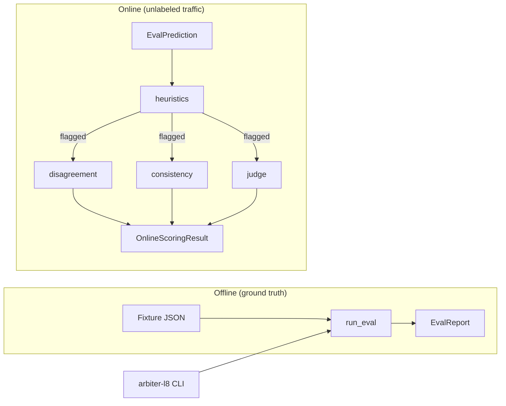

<p align="center">
    
</p>

**Arbiter-L8** is a standalone AI evaluation framework for scoring the outputs of services in the Rhizome Risk system — currently Sentinel-L7 (ComplianceDriver compliance/AML verdicts) and Synapse-L4 (Axiom telemetry validation). It is not embedded in either service: the harness knows nothing about Sentinel or Synapse specifically, only about the normalized prediction contract described below. It's an out-of-band evaluation layer, sitting outside the L4/L7 data path entirely — an informal "Layer 8," judging what the stack produced rather than participating in producing it. See [`docs/adr/0001-standalone-module.md`](docs/adr/0001-standalone-module.md) for the full design rationale.

---



---

## 📋 Contents

- [📋 Contents](#-contents)
- [🧰 Stack](#-stack)
- [🚀 Running the Project](#-running-the-project)
  - [✅ Prerequisites](#-prerequisites)
  - [⚡ Quick Start](#-quick-start)
  - [📦 CLI Reference](#-cli-reference)
- [🏗️ Architecture](#️-architecture)
  - [📐 The Prediction Contract](#-the-prediction-contract)
  - [🔀 Offline vs Online Evaluation](#-offline-vs-online-evaluation)
  - [🔌 Plugging in a New System-Under-Test](#-plugging-in-a-new-system-under-test)
- [📊 Benchmark Results](#-benchmark-results)
- [🔭 Observability](#-observability)
  - [🔍 Overview](#-overview)
  - [📊 Grafana Dashboard](#-grafana-dashboard)
  - [🛠️ Implementation](#️-implementation)
- [🔧 Configuration](#-configuration)
- [📚 Docs](#-docs)
- [🗺️ Roadmap](#️-roadmap)
  - [📋 Planned](#-planned)
  - [🐛 Known Issues](#-known-issues)
  - [🏁 Completed (Phase 3)](#-completed-phase-3)


## 🧰 Stack

**🐍 Core**

- **Python 3.12 + `uv`:** dependency management and the venv, same role `composer`/`npm` play in the sibling Sentinel-L7/Synapse-L4 repos.
- **Pydantic 2.9:** the entire cross-system contract (`EvalPrediction`, `EvalDataset`, `EvalReport`) is typed models, not dicts — see [📐 The Prediction Contract](#-the-prediction-contract).

**🌐 Integrations**

- **httpx:** adapters speak MCP-over-HTTP directly to Sentinel-L7's `/mcp` endpoint and REST to Synapse-L4's `/ingest` — no service SDK, no shared import boundary (ADR-0001).
- **Ollama + Gemini Flash + Upstash Vector:** the online layers' real infrastructure — Ollama for embeddings and the LLM-as-judge, Gemini Flash as the judge's fallback, Upstash Vector for the embedding-consistency layer.

**🔭 Observability**

- **OpenTelemetry:** traces + metrics exported via OTLP/HTTP to the same Collector endpoint Sentinel-L7/Synapse-L4/EventHorizon export to.

**🧪 Testing**

- **pytest + respx:** every external call in the automated suite is mocked at the HTTP boundary — this repo's suite never hits a real API, matching the "never hit real external APIs in tests" rule.


## 🚀 Running the Project

### ✅ Prerequisites

- **Python 3.12+** with `uv`
- Nothing else for `uv sync` / `uv run pytest` — every external call in the automated suite is mocked at the HTTP boundary.
- **Optional, live verification only:** a running Sentinel-L7 and/or Synapse-L4 instance, a reachable Ollama host (embedding + judge), a Gemini API key (judge fallback), Upstash Vector credentials (consistency layer) — copy [`.env.example`](.env.example) to `.env` and fill these in; `config.py` loads `.env` automatically via `python-dotenv` and never overrides a variable already set in the real environment. See [🔧 Configuration](#-configuration).

> [!NOTE]
> Developed on **WSL2 (Ubuntu)**. Other environments may work but are untested.

### ⚡ Quick Start

```bash
# 1. Install dependencies
uv sync

# 2. Run the automated test suite (no live services required)
uv run pytest

# 3. Optional, live verification only: configure real endpoints/credentials
cp .env.example .env
# then fill in GEMINI_API_KEY, UPSTASH_VECTOR_REST_URL/TOKEN — everything
# else in .env.example already has a working default for this dev environment

# 4. Score a fixture against a real Sentinel-L7 instance
uv run arbiter-l8 --system sentinel-l7 \
  --fixture tests/fixtures/sentinel_l7_ground_truth.json \
  --driver ollama --binary --limit 25
```

> [!NOTE]
> For the full live-verification walkthrough — starting local
> Sentinel-L7/Synapse-L4 servers, exercising every online layer by hand,
> expected output for each step — see
> [`docs/DEV_GETTING_STARTED.md`](docs/DEV_GETTING_STARTED.md).

### 📦 CLI Reference

`arbiter-l8` (a `[project.scripts]` entry point,
`arbiter_l8.cli:main`) runs the offline harness from the shell against a
real adapter — no code required for a one-off scoring run. There is
deliberately no CLI surface for the online path
(`online.pipeline.evaluate_item`) — it's meant to be wired into a caller's
own sampling/production loop (which providers/embed_fn/judge to pass in is
a per-deployment decision), not run as a one-shot command the way a
labeled-fixture score is.

| Command / Flag | Description |
| --- | --- |
| `uv run pytest` | Run the full automated test suite (mocked HTTP boundary, no live services required) |
| `uv run arbiter-l8 --system {sentinel-l7,synapse-l4}` | Score a fixture against a real adapter (required) |
| `--fixture PATH` | Labeled `EvalDataset` JSON whose `input` shape matches the chosen adapter's contract (required) |
| `--driver {gemini,openrouter,ollama}` | Sentinel-L7 only — force a specific `ComplianceManager` driver via the per-request override, bypassing the semantic cache |
| `--binary` | Sentinel-L7 only — collapse a predicted label to `'high'` unless it's exactly `'low'`, matching `TransactionProcessorService::gradeAiResult()` |
| `--url URL` | Override the configured base/MCP URL (defaults to `config.py`'s env-var-with-default) |
| `--limit N` | Only score the first N examples of the fixture |
| `--json` | Print the `EvalReport` as JSON instead of a text table |

A connection failure prints a one-line error to stderr and exits `1`
rather than a raw traceback.

**Live-verified**: run against a temporarily-started local Sentinel-L7
server with `--driver ollama` (bypassing the semantic cache) — a live item
scored correctly (`accuracy: 1/1 (100.0%)`). A larger batch surfaced a real
timeout on a slower Ollama response — a single driver-override call has
ranged from ~4.7s to over 10s, occasionally crossing the adapter's
default per-request timeout — and the CLI's
`httpx.ConnectError`/`TimeoutException` handling caught it and exited `1`
with a friendly message rather than crashing, exercising that path against
a genuine failure, not a mock. Full steps, exact commands, and expected
output for every one of these live checks are in
[`docs/DEV_GETTING_STARTED.md`](docs/DEV_GETTING_STARTED.md).


## 🏗️ Architecture

### 📐 The Prediction Contract

Every system-under-test is a callable that takes a raw input dict and
returns an `EvalPrediction`:

```python
class EvalPrediction(BaseModel):
    id: str                        # source_id / correlation token
    raw_output: dict[str, Any]     # untouched domain payload, for debugging
    label: str                     # normalized outcome — e.g. Sentinel's
                                    # risk_level or Synapse's status
    confidence: float
    metadata: dict[str, Any] = {}
```

`label` is a plain `str`, not a shared enum. Sentinel's `risk_level`
(`low|medium|high|critical|unknown`) and Synapse's `status`
(`nominal|degraded|critical`) are different taxonomies — forcing them into
one enum would leak one service's vocabulary into the harness. Each
system-under-test wrapper maps its own domain output into `label`; the
harness only ever compares `label` against ground truth for whichever
system it's currently scoring.

### 🔀 Offline vs Online Evaluation

#### Offline (ground truth) — `arbiter_l8.harness.run_eval`

Runs a labeled dataset through a system-under-test and scores its
predictions against known-correct labels: precision/recall/F1 per label,
plus overall accuracy. **No LLM dependency anywhere in this path** — it
works even if every external model/service is down.

```python
from arbiter_l8.harness import run_eval
from arbiter_l8.models import EvalDataset

dataset = EvalDataset.model_validate({
    "examples": [
        {"input": {...}, "expected_label": "high"},
        ...
    ]
})

report = run_eval(my_system_under_test, dataset)
print(report.accuracy, report.per_label)
```

Three fixtures ship under `tests/fixtures/`: `compliance_dataset.json`
(hand-written, 15 examples) and `sentinel_l7_ground_truth.json` (200
examples, generated from Sentinel-L7's real pre-AI simulation profiles via
`php artisan sentinel:export-ground-truth` — see that repo's
`app/Console/Commands/ExportGroundTruth.php`). The latter's `expected_label`
is only ever `'high'`/`'low'` — ground truth pre-AI only knows a binary
threat flag, not a graded `risk_level` — so scoring Sentinel-L7 predictions
against it should collapse `medium`/`critical` into `'high'` the same way
`TransactionProcessorService::gradeAiResult()` does internally
(`is_threat = risk_level != 'low'`), rather than penalizing a correctly-
caught threat just because it landed on a different severity than `'high'`.

The third, `synapse_l4_ground_truth.json` (12 examples), is hand-derived
rather than generated — Synapse-L4 has no equivalent to
`TransactionStreamService`'s pre-AI labels, and ADR-0001 explicitly defers
the harder question of ground truth for genuine LLM-driven Axiom
extraction as unsolved, out-of-scope follow-up. What this fixture *does*
give real, non-circular ground truth for: `extract()`'s deterministic
"EventHorizon raw document" fast path (`_try_direct_extraction` Shape 2),
which maps `raw.payload.status`/`processed.classification` to
`status`/`anomaly_score` via a fixed, documented rule table — no LLM
involved, so the expected `status` for each example is computed by hand
directly from that rule table, not guessed. Live-verified: `12/12 (100%)`
against a real local Synapse-L4 instance. Every example was deliberately
chosen to avoid a known trap in that same rule table (see
[🐛 Known Issues](#-known-issues)) rather than accidentally exercising it.

#### Online (unlabeled, realistic traffic) — `arbiter_l8.online.*`

Production/sampled traffic has no ground truth, so it's scored by a
layered, cost-ordered pipeline instead. Each layer is more expensive (and
more speculative) than the last, and later layers are only meant to run on
what earlier layers flag as ambiguous — not on every item.

| Layer | File | Status | Purpose |
| --- | --- | --- | --- |
| 1. Heuristics | `online/heuristics.py` | ✅ Implemented | Rule-based checks (confidence thresholds, field-contradiction checks). Free, deterministic, always available. |
| 2. Disagreement | `online/disagreement.py` | ✅ Implemented, live-verified | Cross-provider/cross-run disagreement (e.g. Sentinel-L7's dual Gemini/OpenRouter `ComplianceDriver`). |
| 3. Consistency | `online/consistency.py` | ✅ Implemented, live-verified | Embedding-based consistency against Upstash Vector's `transactions` namespace. |
| 4. Judge | `online/judge.py` | ✅ Implemented, live-verified, validated | LLM-as-judge behind a circuit breaker (Ollama → Gemini Flash → heuristics-only), reserved for the ambiguous tail. |

**2. Disagreement** — reuses infrastructure the system-under-test already
has. `score_disagreement()` calls each named provider with the same input
and compares labels; a provider call that raises is captured in
`errors_by_provider` rather than dropped, and `agreed` is only `True` when
every provider answered with the exact same label — an error makes
agreement unknowable, not automatically true. Uses Sentinel-L7's
per-request driver override (Phase 3 step 6):
`adapters.sentinel_l7.make_sentinel_l7_system_under_test(driver=...)`
builds one callable per provider, each bypassing the semantic cache so the
comparison is never contaminated by a different provider's cached verdict.
Live-verified against a real local Sentinel-L7 server: Ollama returned a
real verdict; OpenRouter and Gemini both genuinely failed (OpenRouter's
configured free model was retired upstream — a 404 "No endpoints found";
Gemini hit the same free-tier quota exhaustion seen validating the judge
layer) and both were correctly surfaced in `errors_by_provider` rather
than silently swallowed or crashing the comparison — exercising the error
path against real external failures, not just mocks.

**3. Consistency** — `make_ollama_embed_fn()` calls Sentinel-L7's own
local Ollama host/model/task-prefix convention exactly (verified against
`OllamaEmbeddingDriver::embed()` directly), never a hardcoded model —
Sentinel-L7's live config has `SENTINEL_EMBEDDING_DRIVER=ollama`, 768-dim
`nomic-embed-text:v1.5`, and embedding independently here would cause
Upstash dimension-mismatch errors the moment the two diverge.
`query_upstash_vector()` mirrors `VectorCacheService::searchNamespace()`'s
exact request shape. **Implemented and live-verified**: a real embed call
against the actual Ollama host returned a 768-dim vector, and a real
Upstash Vector query against the live index succeeded (0 matches,
confirmed correct via the index's own `/info` endpoint — the
`transactions` namespace has no vectors yet in this dev environment, so an
empty result is the right answer, not a bug).

**4. Judge** — best-effort only, behind a circuit breaker: try remote
Ollama (over Tailscale) → on failure/timeout fall back to Gemini Flash
free tier → on failure fall back to heuristics-only. Judge availability is
tracked as its own metric (`JudgeMetrics.pct_scored_by_judge`) rather than
hidden — a judge that silently falls back on every call is itself a
signal worth seeing. Both calls force strict-JSON output at the API level
(Ollama's `"format": "json"`, Gemini's `generationConfig.responseMimeType`)
and load their shared prompt from `prompts/judge.txt` (versioned in
`prompts/judge.md`, mirroring Sentinel-L7's `prompts/*.md`+`*.txt`
convention) rather than hardcoding the prompt text inline. A real call
against the Tailscale Ollama host (`qwen3.5:9b-q4_K_M`) returned a genuine
verdict in ~12s; a real call to Gemini Flash correctly raised
`httpx.HTTPStatusError` on a live 429 (free-tier quota exhausted),
confirming the fail-through contract holds against a real failure, not
just a mocked one.

This eval judge is distinct from Sentinel-L7's
`prompts/synapse-l4-judge.md`, which scores `anomaly_score` for production
routing — different purpose, different consumer. Before this judge is
used to score unlabeled traffic, its verdicts should be validated against
a labeled dataset via the offline `run_eval` path first. An early attempt
against `tests/fixtures/compliance_dataset.json` scored only 6.7%
accuracy, but inspection showed the judge reasoning correctly and just
answering in the *wrong taxonomy* — that fixture's `raw_output` is
Synapse-shaped (`status`/`anomaly_score`) while its `expected_label` is
Sentinel's `risk_level` vocabulary, a mismatch invisible to `run_eval()`
(which never inspects `raw_output`, only compares `label`) until something
reasoned over the raw fields directly. **Validated** as of Phase 3 step 8
against the taxonomy-consistent `sentinel_l7_ground_truth.json` fixture
instead — see [📊 Benchmark Results](#-benchmark-results) below.

### 🔌 Plugging in a New System-Under-Test

Two real adapters exist under `src/arbiter_l8/adapters/`:

- **`synapse_l4.py`**: `make_synapse_l4_system_under_test()` POSTs to
  Synapse-L4's `/ingest` and maps its Axiom response into `EvalPrediction`
  (`status` → `label`, `anomaly_score` → `confidence`). Calls the real
  service over HTTP rather than importing its Python modules directly —
  see the module docstring for why (heavy service-specific dependencies,
  a Python-version mismatch, and an import-time config requirement that
  would all violate the standalone-module mandate).

  **Live-verified**: run against a temporarily-started local Synapse-L4
  instance through the real Extract → Judge → Emit pipeline (`XADD` to
  Sentinel-L7's actual `synapse:axioms` Redis stream on a success). A
  deterministic fast-path case scored correctly (`accuracy: 1/1 (100.0%)`,
  `pipeline_ms: 1340`). A designed contradiction (fast-path input with
  `anomaly_score: 0.93` but `status: "nominal"`) correctly triggered a real
  `422 judge_rejected`. Most notably, a real Ollama call
  (`qwen3.5:9b-q4_K_M`, 13.9s) produced a *genuinely* self-contradictory
  extraction on its own (`anomaly_score: 0.87` with `status: "degraded"`,
  not `"critical"`) — caught by the real rule-based Judge stage, reproducing
  Synapse-L4's own documented "Silent Contradiction" anti-pattern for real
  rather than as a constructed test case. Full commands and output in
  [`docs/DEV_GETTING_STARTED.md`](docs/DEV_GETTING_STARTED.md#3-cli-against-a-real-synapse-l4-server).
- **`sentinel_l7.py`**: `make_sentinel_l7_system_under_test()` speaks
  MCP-over-HTTP directly to Sentinel-L7's `/mcp` endpoint (`analyze-transaction`
  tool) — a hand-rolled minimal JSON-RPC client for this one tool call,
  not the full `mcp` SDK. `risk_level` → `label`, `confidence` → `confidence`
  (`0.0` when Sentinel-L7's rule-based fallback path ran with no AI model
  involved, since `EvalPrediction.confidence` is non-optional). Required a
  small additive change to Sentinel-L7 itself
  (`TransactionProcessorService::process()` previously collapsed its full
  compliance grading down to a boolean `is_threat` before this tool could
  see it — `risk_level`/`narrative`/`confidence`/`policy_refs` are now
  surfaced too, verified backward-compatible against that repo's full test
  suite). Also takes an optional `driver` parameter (`'gemini'`/`'openrouter'`/
  `'ollama'`) that forces Sentinel-L7's per-request `ComplianceManager`
  override instead of its app-wide default — building one instance per
  provider is how `online.disagreement.score_disagreement` gets independent,
  cache-bypassing verdicts for the same transaction.

To wire up a new one:

1. Write a callable `(input: dict) -> EvalPrediction` that calls the target
   service and maps its domain output into the prediction contract above.
   Put the untouched domain payload in `raw_output` and a normalized
   outcome string in `label`.
2. For offline scoring: build an `EvalDataset` (see
   `tests/fixtures/compliance_dataset.json` for the shape) and call
   `run_eval(your_callable, dataset)`.
3. For online scoring: call `online.pipeline.evaluate_item(prediction, ...)`.
   It always runs heuristics first, then only escalates to
   disagreement/consistency/judge for predictions heuristics flags — and
   only for the layers whose dependency (`providers`, `embed_fn`, `judge`)
   you actually pass in. A layer you don't wire up is skipped, not an
   error.


## 📊 Benchmark Results

Live-verification runs against real services, not mocks. The Journal column
links to the entry with full methodology (sample composition, seed, raw
per-item output).

| Date | Fixture | System | Sample | Strict accuracy | Binary accuracy | Notes | Journal |
| --- | --- | --- | --- | --- | --- | --- | --- |
| 2026-07-04 | `sentinel_l7_ground_truth.json` | Sentinel-L7 (`driver=ollama`, cache bypassed) | 25 live / 200 (all 10 `high` + 15 random `low`, seed 42) | 84% | **92%** | First attempt (no driver override) scored 52% — a real semantic-cache amplification bug, not a model failure; tracked as a Known Issue in sentinel-l7's own README. | [step 8](docs/journal/arbiter-l8-2026-07-04T1720-ground-truth-export-and-judge-validation.md) |
| 2026-07-04 | `sentinel_l7_ground_truth.json` | Judge (`qwen3.5:9b-q4_K_M` via Ollama) | Same 25, called unconditionally (bypassing the heuristic gate) | 80% | **92%** | 2/25 verdicts were non-taxonomy tokens (`"reject"`, `"correct"`) instead of a label — a prompt-following gap, not yet fixed. | [step 8](docs/journal/arbiter-l8-2026-07-04T1720-ground-truth-export-and-judge-validation.md) |
| 2026-07-04 | `compliance_dataset.json` | Judge (`qwen3.5:9b-q4_K_M` via Ollama) | All 15 | 6.7% | — | Fixture defect, not a judge failure: `raw_output` is Synapse-shaped, `expected_label` is Sentinel-shaped — the judge answered correctly in the wrong taxonomy. Superseded by the row above; kept here as a documented false alarm. | [step 5](docs/journal/arbiter-l8-2026-07-04T1512-judge-layer.md) |

**Strict vs. binary**: `sentinel_l7_ground_truth.json`'s `expected_label` is
only ever `'high'`/`'low'` (ground truth pre-AI knows only a boolean threat
flag — see [🔀 Offline vs Online Evaluation](#-offline-vs-online-evaluation)
above). *Strict* compares the predicted label string exactly; *binary*
collapses `medium`/`high`/`critical` to `'high'` first
(`is_threat = risk_level != 'low'`, matching
`TransactionProcessorService::gradeAiResult()`). Binary is the number that
reflects what this ground truth can actually justify claiming — a
`critical` verdict on a real threat is a correct catch, not a miss, and
strict accuracy alone would misrepresent that as a failure.


## 🔭 Observability

### 🔍 Overview

Traces and metrics export via OTLP/HTTP to the same Collector
Sentinel-L7/Synapse-L4/EventHorizon use — Arbiter-L8's signal sits in the
shared **[Rhizome Lens](https://github.com/obrienma/rhizome-lens#readme)**
Grafana monitoring stack, not a bespoke dashboard.

### 📊 Grafana Dashboard

> [!INFO]
> Live telemetry, not a static snapshot — the exact split across Ollama/Flash/fallback will shift each time this runs. Two things it doesn't show yet are tracked openly rather than left implicit: **Judge Chain Errors** doesn't yet break out `exception.type`/`exception.message` as columns, and the `gemini_flash` outcome gap noted in [🐛 Known Issues](#-known-issues) is still unconfirmed. Both are tracked in [🗺️ Roadmap](#-roadmap).

<p align="center">
    
</p>

| Panel | What it shows |
|---|---|
| **Judge Outcome Rate (by source)** | Live throughput of judge-layer resolutions, split by which source resolved them: `ollama`, `gemini_flash`, `heuristics_fallback`. Shows the circuit breaker's fallback distribution as it happens, not just a final tally. |
| **% Scored by Judge (vs Fallback)** | Headline availability metric: of all ambiguous items that reached the judge layer, what share got a real LLM opinion (Ollama or Gemini Flash) rather than falling through to heuristics-only. Tracks judge-tier uptime, not judge accuracy. |
| **Per-Layer Latency (p95)** | p95 latency per online-pipeline layer (`heuristics_check`, `cross_provider_disagreement`, `embedding_consistency`, `judge_call`), from the `arbiter_l8.layer.latency` histogram. `judge_call` is expected to dominate — it's the only layer that makes a network call. |
| **Evaluation Throughput** | Rate of `evaluate_item` spans: predictions per second flowing through the full online scoring pipeline. |
| **Evaluation Latency (p50/p95/p99)** | End-to-end `evaluate_item` duration, from Tempo. Includes whichever subset of layers 2–4 actually ran for a given item, since escalation is dependency-gated. |
| **Judge Outcome (cumulative, by source)** | Running total of judge outcomes per source since the counter started, as a sanity check alongside the rate panel. |
| **Judge Chain Errors (exception events)** | Exception span events under `arbiter-l8` traces — an `ollama_attempt` or `flash_attempt` that raised before the breaker fell through to the next source. Exception type/message live on the span but aren't shown as table columns yet. |
| **Recent Evaluations** | Most recent `evaluate_item` traces; opens into the full per-item layer waterfall (heuristics → disagreement/consistency → judge). |


### 🛠️ Implementation

> OTLP export is always on; the SDK degrades gracefully without a reachable
> Collector — `uv run pytest` never depends on one (the "connection
> refused" warnings on exit at `:4318` are expected, same posture
> Synapse-L4 uses; see `docs/DEV_GETTING_STARTED.md`).

Every layer function and `evaluate_item` are wrapped in `@traced_layer(...)`
(`arbiter_l8.observability.decorators`), so a single trace shows a scored
item's full path through the pipeline — fallback attempts included, not
just the final outcome.

The SDK initializes as an import-time side effect
(`observability/tracing.py`, `metrics.py`) rather than behind a lazy init
function — this avoids Synapse-L4's suspected trace-fragmentation bug,
caused by configuring OTel inside a FastAPI `lifespan` handler after
routes already exist.

## 🔧 Configuration

`src/arbiter_l8/config.py` holds env-var-with-default settings for
calling real systems-under-test (same style as `observability/_env.py`):
`SYNAPSE_L4_BASE_URL`, `SENTINEL_L7_MCP_URL`, `OLLAMA_JUDGE_HOST`/
`OLLAMA_JUDGE_MODEL` (remote, over Tailscale — LLM-as-judge only),
`OLLAMA_URL`/`OLLAMA_EMBEDDING_MODEL` (same env var names as Sentinel-L7's
own embedding config — defaults to the same Tailscale host as
`OLLAMA_JUDGE_HOST`, since one Ollama instance serves both the judge and
embedding models here, but they're independent settings, each overridable
on its own), `GEMINI_API_KEY`/`GEMINI_FLASH_URL` (same env var
names Sentinel-L7 uses, so one value covers both services), and
`UPSTASH_VECTOR_REST_URL`/`UPSTASH_VECTOR_REST_TOKEN`/
`UPSTASH_VECTOR_THRESHOLD` (same env var names and default threshold as
Sentinel-L7's `config/services.php` — no default URL/token, since those
are account-specific secrets).

Copy [`.env.example`](.env.example) to `.env` and fill in the
account-specific secrets — `config.py` calls `load_dotenv()` as an
import-time side effect, so `.env` is picked up automatically without any
extra wiring at call sites. A real environment variable, if already set,
always wins over `.env`. `.env` is gitignored; `.env.example` is the
committed template.


## 📚 Docs

| File | Contents |
| --- | --- |
| [README.md](README.md) | Project overview |
| [docs/adr/0001-standalone-module.md](docs/adr/0001-standalone-module.md) | Why Arbiter-L8 is standalone, not embedded in Sentinel-L7 |
| [docs/adr/0002-online-escalation-pipeline.md](docs/adr/0002-online-escalation-pipeline.md) | Design record for the cost-ordered, escalation-gated online scoring pipeline |
| [docs/USER_STORIES.md](docs/USER_STORIES.md) | User stories by actor/domain — implemented, aspirational, and explicitly deferred |
| [docs/DEV_GETTING_STARTED.md](docs/DEV_GETTING_STARTED.md) | Full live-verification walkthrough — manual tests against real Sentinel-L7/Synapse-L4/online-layer infrastructure |
| [docs/journal/](docs/journal/) | Engineering journal — one entry per phase/step |
| [docs/probes/](docs/probes/) | Paired Anki spaced-repetition probe cards, one file per journal entry |
| [prompts/judge.md](prompts/judge.md) | Judge prompt — versioned Markdown, changelog, `Used by:` list |


## 🗺️ Roadmap

### 📋 Planned

- [ ] **Surface `exception.type`/`exception.message` as Judge Chain Errors panel columns** — the exception already lands on the `ollama_attempt`/`flash_attempt` spans (OTel auto-records it there, see `test_traced_layer_records_exception_on_span` in `tests/test_observability.py`); this is a Grafana panel/dashboard config gap, not an Arbiter-L8 code gap. See [🔭 Observability](#-observability).
- [ ] **Route the unresolved ambiguous tail to human review** — `heuristics_fallback` is currently the terminal state for judge-unavailable items, not a queue entry; no human-verdict store or review surface exists yet.
- [ ] **Measure judge trustworthiness, not just judge availability** — depends on the human-review item above; `arbiter_l8.judge.outcome` today answers "did an LLM respond," not "was it right."
- [ ] **Re-run the full 25-item judge validation sample** against the v2 prompt to get a real before/after accuracy comparison — only a single live spot-check has been done so far (see [📊 Benchmark Results](#-benchmark-results)); the original 92%/80% numbers still reflect the v1 prompt.
- [ ] **Ground truth for genuine LLM-driven Axiom extraction** — `synapse_l4_ground_truth.json` only covers the deterministic fast path (no LLM involved); ADR-0001 still flags real extraction-correctness ground truth as unsolved, out of scope for Phase 3.
- [ ] **Add an offline-eval panel to the Grafana dashboard** — `run_eval()` emits an `arbiter_l8.harness.metric` gauge (precision/recall/f1/accuracy per call) so a prompt/model swap should be visible as a step change over time, but the current dashboard only covers the online pipeline; no panel plots this metric yet.
- [ ] **Mirror the confirmed-flowing observability status in Rhizome Lens's own service status table** — this repo's traces/metrics are now verified landing in a live Collector (see [🔭 Observability](#-observability)); that status isn't yet reflected on the Rhizome Lens side.

> **Not planned:** a CLI surface for the online layers. This is a documented non-goal, not deferred-until-later work — wiring providers/`embed_fn`/judge is a per-deployment decision (see [📦 CLI Reference](#-cli-reference)), not a one-shot command.

### 🐛 Known Issues

- **A `--driver ollama` call can exceed the adapter's 10s default timeout.** Against the real model, a single Sentinel-L7 `--driver ollama` call has ranged from ~4.7s to over 10s — occasionally crossing the adapter's default per-request timeout and surfacing as a genuine `httpx.TimeoutException`. Expected variance for real inference, not a CLI bug: the timeout is caught and reported cleanly (`docs/DEV_GETTING_STARTED.md`).

- **`compliance_dataset.json` isn't adapter-compatible — use `sentinel_l7_ground_truth.json` instead.** Its `input` shape predates the current adapter contract (Synapse-shaped fields flattened, missing the `source_id`/`payload` envelope). It's retained intentionally, as a hand-written smoke fixture for judge-prompt testing, not for real adapter runs.

- **Sentinel-L7's semantic cache can amplify a single wrong verdict for narrow-profile merchants.** Only affects online-layer/CLI runs against Sentinel-L7 when `--driver` isn't forced. This is Sentinel-L7's own caching behavior, not an Arbiter-L8 issue — see Sentinel-L7's README Known Issues for detail.

- **Synapse-L4's deterministic fast path can produce a self-contradictory Axiom — and the Judge stage catches it.** `extract()`'s Shape 2 mapping (`_try_direct_extraction`) derives `status` from `raw.payload.status` independently of how it derives `anomaly_score` from `processed.classification`. An event with `status: "passed"` and `classification: "critical"` deterministically produces `status: "nominal"` + `anomaly_score: 0.9` — an internal contradiction the Judge stage correctly rejects (`anomaly_score >= 0.8 requires status 'critical'`) rather than silently passing through. Confirmed live and reproducible on demand, no LLM involved. This is Synapse-L4's own code; fixing it there is out of scope for Arbiter-L8 per the standalone boundary in `docs/adr/0001-standalone-module.md`.

- **`gemini_flash` hasn't appeared as a judge-outcome source yet — likely explained by Gemini free-tier quota limits.** Since going live, judge outcomes have split between `ollama` and `heuristics_fallback` only. The probable cause is Gemini free-tier quota exhaustion during the same session (see Benchmark Results): if Flash is out of quota, every Ollama failure falls straight through to `heuristics_fallback` without a Flash outcome ever landing. That's a strong read of the pattern but not yet confirmed against exception data — see the Roadmap item to surface `exception.type`/`exception.message` on judge-chain error spans, which would confirm it directly instead of by inference.

### 🏁 Completed (Phase 3)

<details>
<summary>🔍 View shipped steps...</summary>

1. Foundational `config.py` + `httpx` dependency
2. Synapse-L4 HTTP adapter (`adapters/synapse_l4.py`) — live-verified against a real local instance, including a real self-contradictory Ollama extraction correctly caught by the Judge stage
3. Sentinel-L7 MCP-over-HTTP adapter (`adapters/sentinel_l7.py`) — required a paired additive widening of Sentinel-L7's `TransactionProcessorService::process()`
4. Embedding consistency layer (`online/consistency.py`) — live-verified against a real Ollama host and Upstash Vector index
5. LLM-as-judge layer (`online/judge.py`, `prompts/judge.md`+`.txt`) — live-verified against real Ollama and Gemini Flash calls
6. Sentinel-L7 per-request driver override (cross-repo, sentinel-l7 only — bypasses the semantic cache for fresh, cross-provider verdicts)
7. Cross-provider disagreement layer (`online/disagreement.py`) — live-verified, including genuine external provider failures
8. Ground-truth export command + taxonomy-consistent fixture (`sentinel_l7_ground_truth.json`) — closed the judge-validation gate (92% binary accuracy for both Sentinel-L7 and the judge)
9. CLI entrypoint (`arbiter-l8` console script) — offline harness only, live-verified against a real local Sentinel-L7 server
10. CLI error handling widened to catch `SentinelL7Error`/`SynapseL4Error`, not just connection/timeout failures — a rejected request (e.g. a real Synapse-L4 `422 judge_rejected`) now prints a friendly one-liner and exits `1` instead of a raw traceback, live-verified
11. Judge prompt-following fix (`prompts/judge.txt` v2) — explicit instruction that `verdict` must be a label, not a correctness judgment, paired with a runtime guard in `online/judge.py`'s `_parse_verdict()` that rejects known non-label tokens (`"reject"`, `"correct"`, etc.) and falls through the circuit breaker like any other failure; spot-verified live against the real Ollama judge host
12. `synapse_l4_ground_truth.json` (12 examples) — hand-derived ground truth for Synapse-L4's deterministic fast-path extraction, live-verified `12/12 (100%)`; also surfaced a real, reproducible contradiction trap in that same fast path (see Known Issues)

</details>