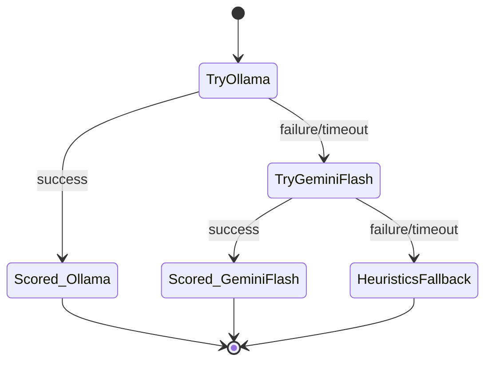

In sentinel-eval, the {{c1::Adapter}} pattern lets `EvalPrediction` stay
domain-agnostic: each system-under-test maps its own vocabulary
(Sentinel's `risk_level`, Synapse's `status`) into the shared envelope at
the boundary, so `run_eval()` never sees a domain-specific shape.

Extra: sentinel-eval · Pattern: Adapter
See: docs/journal/sentinel-eval-2026-07-03T1844-offline-harness-scaffold.md

---

---
type: image-occlusion
deck: Rhizome::sentinel-eval
tags: [sentinel-eval, circuit-breaker]
diagram: judge-circuit-breaker
---
occlusions:
  - node: TryOllama
    hint: first source the judge circuit breaker attempts?
    rect: left=.38:top=.10:width=.24:height=.09
  - node: TryGeminiFlash
    hint: what does the breaker try after Ollama fails/times out?
    rect: left=.38:top=.38:width=.24:height=.09
  - node: HeuristicsFallback
    hint: terminal state when both Ollama and Gemini Flash are unavailable?
    rect: left=.60:top=.65:width=.28:height=.09

Header: sentinel-eval judge circuit breaker
Back Extra: sentinel-eval · Pattern: Circuit Breaker
See: docs/journal/sentinel-eval-2026-07-03T1844-offline-harness-scaffold.md

---
type: cloze
deck: Rhizome::sentinel-eval
tags: [sentinel-eval, leaky-abstraction]
---
`EvalPrediction.label` is typed as a plain {{c1::str}}, not a shared
`Literal` enum, so that Sentinel's `risk_level` and Synapse's `status`
vocabularies never leak into each other through the harness.

Extra: sentinel-eval · Anti-Pattern Avoided: Leaky Abstraction
See: docs/journal/sentinel-eval-2026-07-03T1844-offline-harness-scaffold.md

---
type: cloze
deck: Rhizome::sentinel-eval
tags: [sentinel-eval, fail-loud]
---
In `JudgeCircuitBreaker.judge()`, {{c1::NotImplementedError}} is re-raised
instead of being caught by the generic fallback `except`, so an unbuilt
judge call fails loudly instead of silently recording itself as a real
`heuristics_fallback` outage.

Extra: sentinel-eval · Anti-Pattern Avoided: Fail-Silent Stub Masking
See: docs/journal/sentinel-eval-2026-07-03T1844-offline-harness-scaffold.md

---
type: basic
deck: Rhizome::sentinel-eval
tags: [sentinel-eval, confusion-matrix]
---
Q: Why does sentinel-eval's test suite include a deliberately flawed
predictor (mislabeling every "critical" as "high"), when a perfect
predictor test already exists?

A: A perfect predictor drives every per-label precision/recall/F1 to 1.0
regardless of whether the confusion-matrix counting logic is correct —
tp/fp/fn all collapse trivially when there are no wrong predictions. Only
a predictor that gets some labels wrong exercises the off-diagonal counts
(false positives on "high", false negatives on "critical") enough to catch
a broken formula.

Extra: sentinel-eval · Challenge: Precision/Recall Test Design
See: docs/journal/sentinel-eval-2026-07-03T1844-offline-harness-scaffold.md
